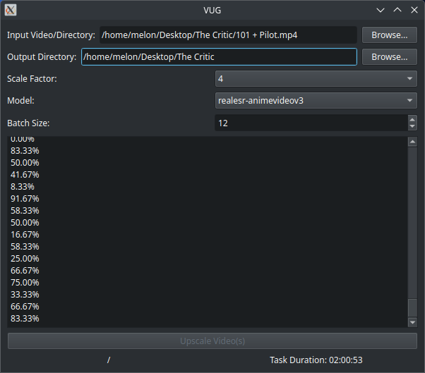

# VUG - Video Upscaling GUI



[](https://www.gnu.org/licenses/gpl-3.0)
[](https://python.org)
[](https://briefcase.readthedocs.io)

VUG is a cross-platform GUI application for video upscaling using Real-ESRGAN neural networks. Built with Python and PySide6, managed with BeeWare's Briefcase.

## Features

- User-friendly graphical interface
- Multiple Real-ESRGAN model support
- Adjustable scaling factors (2x, 3x, 4x)
- Configurable batch processing
- Real-time progress logging
- Task duration tracking
- Preserves original audio tracks
- Supports common video formats (MP4, MOV, AVI, MKV, etc.)

## Requirements

**Core Dependencies:**

- Python 3.8+
- [FFmpeg](https://ffmpeg.org/download.html) (system PATH)
- [realesrgan-ncnn-vulkan](https://github.com/xinntao/Real-ESRGAN-ncnn-vulkan) (system PATH)

## Installation

**From Source:**

```bash
git clone https://codeberg.org/Melon-Bread/VUG
cd VUG
pip install briefcase # Can also use pipx
```

## Usage

1. Ensure required binaries are in your PATH:
   - [ffmpeg](https://ffmpeg.org/download.html)
   - [realesrgan-ncnn-vulkan](https://github.com/xinntao/Real-ESRGAN-ncnn-vulkan)

2. Launch VUG:

```bash

briefcase run
```

3. GUI Interface:
   - Select input video/directory
   - Choose output directory
   - Configure upscaling parameters
   - Monitor progress via real-time logs

## Supported Models

- realesr-animevideov3
- realesrgan-x4plus
- realesrgan-x4plus-anime
- realesrnet-x4plus

## Contributing

1. Fork the repository  
2. Create feature branch  
3. Submit pull request  
4. Ensure code complies with GPLv3+ license  

## Third-Party Tools

- FFmpeg: LGPL-2.1-or-later  
- Real-ESRGAN-ncnn-vulkan: MIT License  
- PySide6: LGPL-3.0-only  
- Briefcase: BSD-3-Clause  

